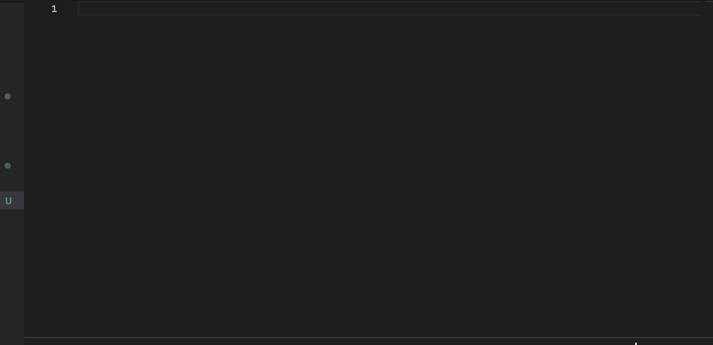

# vben-snippet-vscode 
vben代码辅助,代码片段自动完成

## e.g. table gif

### features
* 新增Modal + Form组件代码片段
* fschema
* add basic button ([44cf22a](https://github.com/yingqiwang/vben-snippet-vscode/commit/44cf22a10117fab82284689791353dcbff14cc55))
* add gif ([c65583f](https://github.com/yingqiwang/vben-snippet-vscode/commit/c65583fdd02403c2104337d13cf843ac521bd6bb))
* add modal form ([6c2b171](https://github.com/yingqiwang/vben-snippet-vscode/commit/6c2b1713e4997995860f4b181fbc8163b6a7dbd9))
* add vbFormGetSchema ([45f752c](https://github.com/yingqiwang/vben-snippet-vscode/commit/45f752c44a81b03f07816d28976ea650c9bfa3e3))
* first blood ([5fdd83e](https://github.com/yingqiwang/vben-snippet-vscode/commit/5fdd83e8b3c74f66cddf28da560d899fe6057191))
